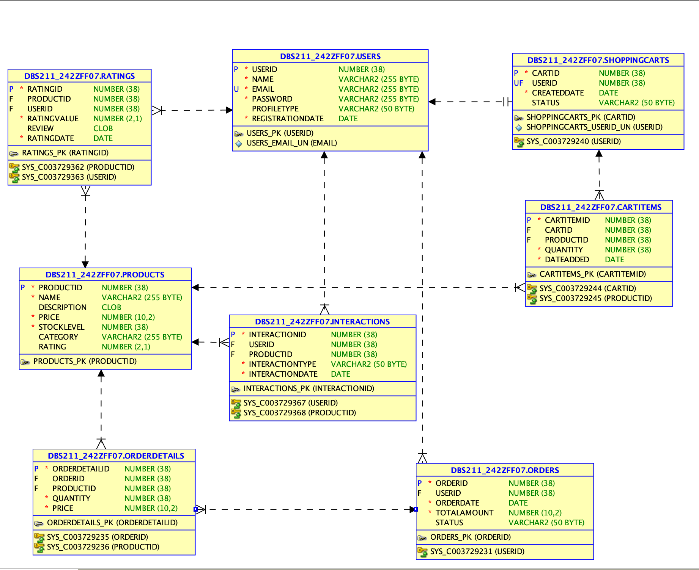

# PetsPros 🐶 – SQL E-Commerce Database

A relational database system designed for an online pet supply store. Built in Oracle SQL, PetsPros manages customers, products, orders, inventory and more.

## 🗂️ Features

- Normalized schema with 6+ interlinked tables
- Customer order history tracking
- Inventory management with automated stock updates
- Sample queries for data insights

## 📊 Analytics Snapshot (June–July 2024)

Here’s a look at the live Shopify performance for PetsPros during a peak operational period:


- 1,200+ sessions across 5 countries 🌎
- Top locations: 🇺🇸 United States, 🇨🇦 Canada, 🇸🇬 Singapore
- 2.25% Conversion rate
- Most users accessed via **mobile**

> Data reflects activity between June 3 – July 30, 2024.

## 🧩 Tables Included

- `Customers`
- `Products`
- `Orders`
- `Order_Items`
- `Inventory`
- `Categories`

## 🧪 Technologies

- Oracle SQL
- ERD designed using dbdiagram.io

## 📊 ERD



## 🤩 Instagram

> 🐾 While PetsPros.co is no longer live, you can still check out our archived Instagram page:  
[instagram.com/petspros.co](https://www.instagram.com/petspros.co)

## 🧾 Sample Queries

```sql
-- Find top 5 most ordered products
SELECT p.product_name, COUNT(*) AS total_orders
FROM Order_Items oi
JOIN Products p ON oi.product_id = p.product_id
GROUP BY p.product_name
ORDER BY total_orders DESC
FETCH FIRST 5 ROWS ONLY;
